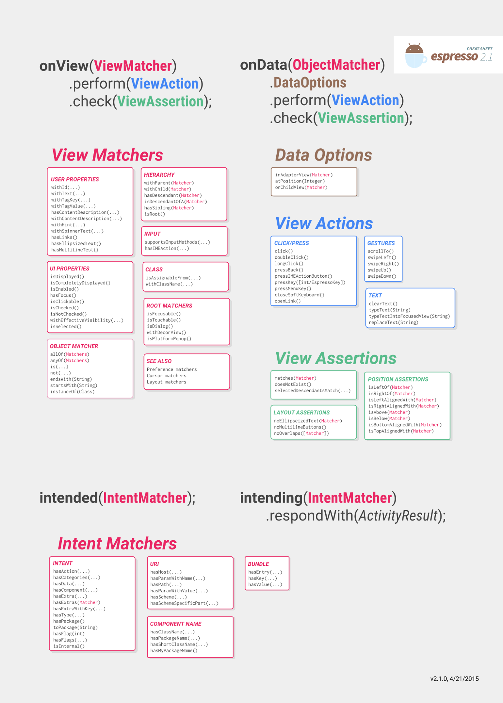

# Espresso

### Espresso is an open source android user interface (UI) testing framework.

### Espresso four components :

1. #### Espresso
2. #### ViewMatchers
3. #### ViewActions
4. #### ViewAssertions

### For Example :

onView(withId(R.id.my_view),withText("Hello!"))

.perform(typeText("Hello"),click())

.check(matches(withText("Hello!")));

### Another perk of espresso is that it observes the activity lifecycle. Therefore, you don’t have to write additional logic to handle them since espresso does it for you .
